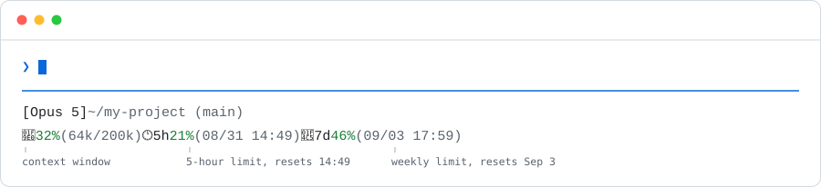

<p align="center">
  <picture>
    <source media="(prefers-color-scheme: dark)" srcset="assets/example-dark.svg">
    <source media="(prefers-color-scheme: light)" srcset="assets/example-light.svg">
    
  </picture>
</p>

<p align="center">
  <a href="LICENSE"></a>
  <a href="https://github.com/qndls42/cc-status-lite/releases/latest"></a>
  
  <a href="README.ko.md"></a>
</p>

# Know how much you have left, without leaving Claude Code

Two lines at the bottom of the terminal. Context usage on the left, your 5-hour and weekly limits on the right — each with the local time it resets.

Claude Code tells a status line how much context a session has used. It does not tell it anything about your rate limits, which is the number you actually want when you are deciding whether to start one more task. cc-status-lite fetches that from the same endpoint Claude Code itself uses, caches it for a minute, and renders it without ever blocking your terminal.

Two implementations, one behavior: a POSIX shell script for macOS and Linux, and a native PowerShell script for Windows. Both are held to the same test cases.

## Install

Three commands. The first two go in Claude Code.

### 1. Add the marketplace

```
/plugin marketplace add qndls42/cc-status-lite
```

### 2. Install the plugin

```
/plugin install cc-status-lite@cc-status-lite
```

### 3. Turn the status line on

Restart Claude Code. On the next session Claude offers to enable it — say yes, and you are done.

To do it yourself instead:

```
/statuslite-install
```

> [!TIP]
> Setup is correct when the status line shows two lines, the percentages are coloured, and the 5h/7d figures appear within a minute. If the first line shows but the second does not, the plugin is installed and the status line is not — run `/statuslite-install`.

### Requirements

| Platform | Needs |
|---|---|
| **macOS · Linux** | `jq` |
| **Windows** | nothing |

`jq` is the only thing the installer checks for, and the only one you normally have to install.

> [!NOTE]
> The status line also calls `curl` and `git`. Both ship with macOS and every mainstream Linux, so there is usually nothing to do — but on a slim container image or a minimal server install you may need to add them:
>
> ```bash
> sudo apt install curl git
> ```
>
> `curl` is what fetches the 5-hour and weekly figures from the API; without it those two segments never appear. `git` is what reads the branch name; without it the branch is left out. Everything else renders either way.

<details>
<summary><strong>macOS · Linux</strong> — installing <code>jq</code></summary>

<br>

If `jq` is missing the installer prints the command for your platform and stops — it never installs anything on your behalf.

```bash
brew install jq          # macOS
sudo apt install jq      # Debian, Ubuntu
sudo dnf install jq      # Fedora
```

</details>

<details>
<summary><strong>Windows</strong> — no dependencies, and why</summary>

<br>

Windows uses a separate PowerShell implementation. PowerShell and `curl.exe` ship with Windows 10 1803 and later, and `ConvertFrom-Json` is built in, so neither Git Bash nor `jq` is required.

If you already have Git Bash and `jq` you may use the shell implementation instead by running `scripts/install.sh` from a clone. The two produce identical output; the PowerShell one is the default because it needs nothing installed.

One caveat worth knowing: the `bash` on a default Windows `PATH` is usually the WSL launcher, not Git Bash. If you want the shell implementation, call Git Bash by its full path — typically `C:\Program Files\Git\bin\bash.exe`.

</details>

## Reading the status line

```
[Opus 5] ~/my-project (main)
🧠 32% (64k/200k)  🕐 5h 21% (08/31 14:49)  📅 7d 46% (09/03 17:59)
```

| Segment | Means |
|---|---|
| `[Opus 5]` | The model this session is using |
| `~/my-project (main)` | Working directory, abbreviated to `~`, and the git branch when there is one |
| 🧠 `32% (64k/200k)` | Context used, tokens used, and the size of the context window |
| 🕐 `5h 21% (08/31 14:49)` | The 5-hour limit, and the local time it resets |
| 📅 `7d 46% (09/03 17:59)` | The weekly limit, and the local time it resets |

Colour carries the urgency, so you can read it without reading it:

| | Percentage | Reset time |
|---|---|---|
| **below 70%** | green | dim |
| **70% and up** | yellow | yellow |
| **90% and up** | red | red |
| **stale** | dim | dim |

*Stale* means no successful refresh for fifteen minutes — usually an expired token, which Claude Code renews on its own. The values stay on screen rather than disappearing, marked as no longer current.

## Why it works this way

### #1 The limits are not in the data a status line receives

**The problem.** Claude Code hands a status line the model, the working directory and the context window. Your 5-hour and weekly utilisation are not in there, and they are the numbers that decide whether you start another task.

**The fix.** One authenticated request to `https://api.anthropic.com/api/oauth/usage`, the same endpoint Claude Code uses. It is cached for a minute and refreshed in a detached background process, so rendering never waits on the network. If the refresh fails, the last known values are dimmed rather than dropped.

### #2 A plugin cannot set the status line

**The problem.** Claude Code's [plugin reference](https://code.claude.com/docs/en/plugins-reference) allows only `agent` and `subagentStatusLine` in a plugin's settings — not the main `statusLine`. And `${CLAUDE_PLUGIN_ROOT}` is not expanded inside `settings.json`, while the plugin's own directory carries its version in the path and therefore changes on every update.

**The fix.** One write to your `settings.json`, pointing at a fixed path in your config directory. A `SessionStart` hook then compares that copy against the plugin's on every session and refreshes it when they differ. `/plugin update` is enough — there is no `git pull` and no reinstall.

### #3 Windows is not an afterthought

**The problem.** A shell script on Windows means Git Bash and `jq`, which is a real barrier for something you install in thirty seconds.

**The fix.** A native PowerShell implementation, not a wrapper. Both are held to the same cases in [`tests/cases/`](tests/cases), read by both runners, so they cannot quietly drift apart. Writing it surfaced defects that macOS could not have exposed at all: astral-plane emoji silently vanishing through `[char]`, `/` in a .NET date format resolving to the culture's date separator, and file reads defaulting to the system ANSI code page.

## What this reads and sends

This plugin reads your Claude credentials. That is worth stating plainly.

**What it reads.** Claude Code's own OAuth access token, from the macOS keychain (`security find-generic-password -s 'Claude Code-credentials'`) or, on other platforms, from `~/.claude/.credentials.json`.

**Where it sends it.** One request, to `https://api.anthropic.com/api/oauth/usage`. The URL is hard-coded; nothing from your environment is interpolated into it. There is no other network call, no telemetry, and no third party.

**How the token is handled.** Never as a command-line argument. Process arguments are world-readable through `ps` on macOS and `/proc/<pid>/cmdline` on Linux, so an argument would let any other local user — or any unprivileged process, without ever unlocking the keychain — read it. The shell implementation passes the header over stdin via `curl --config -`; the PowerShell one keeps it in memory. The token is never written to disk, and this plugin never refreshes or stores it.

**What it writes.** `~/.claude/.cc-status-lite-cache.json`, mode `600`, holding four fields: `utilization` and `resets_at` for the 5-hour and weekly windows. The API response also carries spend and credit balances; those are discarded rather than cached, because the status line does not display them.

**What it changes in your settings.** One key, `statusLine`. The installer backs up `settings.json` first and records any status line it replaces, so the uninstaller can put it back.

**What it never does.** Refresh tokens, write credentials anywhere, call any host other than `api.anthropic.com`, or send your data to anyone.

Every claim above is a few lines of [`scripts/statusline.sh`](scripts/statusline.sh) or [`scripts/statusline.ps1`](scripts/statusline.ps1) — both short enough to read in full before installing them, and reading them first is the right instinct.

## Updating

```
/plugin update cc-status-lite@cc-status-lite
```

Nothing else. The `SessionStart` hook syncs the installed copy on the next session.

## Uninstall

```
/statuslite-uninstall
```

Restores whatever status line you had before, or removes the key if you had none. Nothing else in `settings.json` is touched. To remove the plugin as well:

```
/plugin uninstall cc-status-lite@cc-status-lite
```

## What's in the repository

| Path | Contains |
|---|---|
| [`scripts/statusline.sh`](scripts/statusline.sh) · [`.ps1`](scripts/statusline.ps1) | The status line itself, one implementation per platform |
| [`scripts/install.sh`](scripts/install.sh) · [`.ps1`](scripts/install.ps1) | Writes the `statusLine` key; backs up what was there |
| [`scripts/uninstall.sh`](scripts/uninstall.sh) · [`.ps1`](scripts/uninstall.ps1) | Restores it and removes the files |
| [`scripts/json-format.ps1`](scripts/json-format.ps1) | Keeps PowerShell from reshaping your whole `settings.json` |
| [`hooks/`](hooks) | The `SessionStart` hook that keeps the installed copy current |
| [`skills/`](skills) | `/statuslite-install` and `/statuslite-uninstall` |
| [`tests/`](tests) | Shared cases and a runner for each implementation |

### Behavior at a glance

| Behavior | Rule |
|---|---|
| Refresh interval | At most once a minute, in a detached process |
| Blocking | Never — rendering reads the cache only |
| Stale threshold | 15 minutes without a successful refresh |
| Colour thresholds | Yellow at 70%, red at 90% |
| Reset time | Local time, converted from the UTC the API returns |
| Cache | Four fields, mode `600` |
| Settings written | One key, `statusLine`, after a backup |
| Updates | A `SessionStart` hook syncs the copy; no reinstall |

## Troubleshooting

**The 5h/7d values never appear.** The first refresh takes up to a minute. After that, check that `~/.claude/.cc-status-lite-cache.json` exists. If it does not, the token lookup failed — sign in again in Claude Code and start a new session.

**They appear but stay dim.** Dim means no successful refresh for fifteen minutes, usually an expired token. Claude Code renews credentials on its own; the values recover on the next successful call.

**Nothing shows at all.** Confirm `statusLine` in `~/.claude/settings.json` points at `cc-status-lite`, and that the script runs on its own:

```bash
echo '{"model":{"display_name":"Test"},"workspace":{"current_dir":"'"$HOME"'"},"context_window":{"used_percentage":42,"total_input_tokens":84000,"context_window_size":200000}}' \
  | bash ~/.claude/cc-status-lite.sh
```

**`bad interpreter: /bin/sh^M` on Windows.** The scripts were checked out with CRLF endings. `.gitattributes` pins them to LF; re-clone, or run `git config core.autocrlf false` and check out again.

**`/statuslite-install` appears twice.** An older manual clone is still in `~/.claude/skills/`. Delete it — the plugin supersedes it.

## FAQ

**Does it slow down my terminal?**
No. Rendering reads a cache file and nothing else. The network call happens in a detached background process, at most once a minute, and the status line never waits for it.

**Why does it need my credentials at all?**
Because rate-limit utilisation is not part of what Claude Code hands a status line. It has to be requested, and the request has to be authenticated as you. See [What this reads and sends](#what-this-reads-and-sends).

**Can I change the colours or the thresholds?**
Not through a setting. The scripts are short and readable — fork them and change the `c_of` function in the shell version, or `Get-Colours` in the PowerShell one.

**Does it work with a custom `CLAUDE_CONFIG_DIR`?**
The config directory is respected. On macOS the keychain lookup is not: Claude Code appends a hash to the keychain service name when `CLAUDE_CONFIG_DIR` is set, and that combination is unsupported. The 5h/7d values will not appear.

**Can I run the shell version on Windows?**
Yes, with Git Bash and `jq`. Run `scripts/install.sh` from a clone. Note that the `bash` on your `PATH` is probably the WSL launcher, not Git Bash.

## Development

```bash
sh tests/run-tests.sh                                                    # macOS, Linux, Git Bash
powershell -NoProfile -ExecutionPolicy Bypass -File tests\run-tests.ps1   # Windows
```

Both runners read the same cases from [`tests/cases/`](tests/cases), so the two implementations are held to one set of expectations. See [tests/README.md](tests/README.md) before adding a case.

## License

[MIT](LICENSE)
